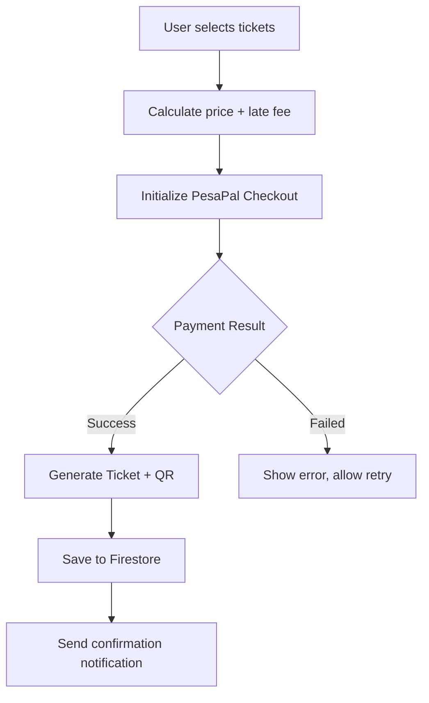
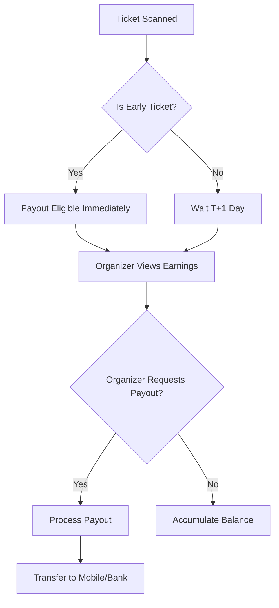

# YoVibe Ticketing System Implementation Analysis

## Executive Summary

This document analyzes the proposed ticketing system plan for implementation in the YoVibe project using **PesaPal** (not Flutterwave as originally specified). The analysis covers current state assessment, gap analysis, and actionable recommendations for implementation.

---

## 1. Current Project State Assessment

### 1.1 Existing Infrastructure

| Component | Current Status | Readiness Level |
|-----------|----------------|-----------------|
| **Ticket Model** (`src/models/Ticket.ts`) | Partial implementation with core fields | 🟡 Medium |
| **PaymentService** (`src/services/PaymentService.ts`) | Mock/simulated implementation | 🔴 Not Ready |
| **TicketService** (`src/services/TicketService.ts`) | Partial implementation, missing Firebase methods | 🔴 Not Ready |
| **Ticket Purchase Screen** | Existing UI for ticket contact info | 🟢 Ready |
| **Ticket Scanner Screen** | Existing UI with biometric validation | 🟢 Ready |
| **Firestore Rules** | No ticket-specific rules defined | 🔴 Not Ready |
| **Cloud Functions** | No ticket-related functions | 🔴 Not Ready |

### 1.2 Current Ticket Model Comparison

**Existing Fields (src/models/Ticket.ts):**
```typescript
interface Ticket {
  id, eventId, eventName, buyerId, buyerName, buyerEmail,
  quantity, totalAmount, venueRevenue, appCommission,
  purchaseDate, qrCode, biometricHash, status,
  validationHistory[]
}
```

**Missing Fields from Plan:**
- `isLatePurchase` - To track late ticket fees
- `payoutEligible` - For organizer payout eligibility
- `payoutStatus` - Track payout state (pending/paid)
- `scannedAt` - Timestamp of validation
- `paymentId` - PesaPal transaction reference

---

## 2. PesaPal vs Flutterwave Comparison

Since the user requested **PesaPal** instead of Flutterwave, here are the key differences:

### 2.1 PesaPal Integration Requirements

| Aspect | PesaPal | Notes |
|--------|---------|-------|
| **API** | PesaPal Checkout/PG | Requires merchant credentials |
| **Local Support** | Uganda, Kenya, Tanzania | Perfect for Ugandan market |
| **Integration** | JavaScript SDK + IPN | Real-time payment notifications |
| **Fees** | ~2.5% + fixed fee | Varies by channel |
| **Payouts** | Requires separate integration | Not same as collections |

### 2.2 Recommended Integration Approach



---

## 3. Gap Analysis & Implementation Recommendations

### 3.1 Phase 1: Data Model Updates

**Priority: HIGH**

| Task | Action | Impact |
|------|--------|--------|
| Update Ticket interface | Add missing fields | Enables late fee tracking |
| Create Wallet model | New `/organizers/{id}/wallet` collection | Enables payout tracking |
| Create Payout model | New `/payouts/{id}` collection | Track withdrawals |

**Recommended Ticket Model Update:**
```typescript
// New fields to add
interface Ticket {
  // ... existing fields
  
  // New fields for ticketing system
  isLatePurchase: boolean;      // Track if late fee applied
  lateFeeAmount?: number;        // Amount of late fee
  payoutEligible: boolean;       // Ready for organizer payout
  payoutStatus: 'pending' | 'processing' | 'paid';
  scannedAt?: Date;              // When ticket was validated
  paymentId: string;             // PesaPal transaction ID
  
  // Event timing for late fee calculation
  eventStartTime: Date;
  purchaseDeadline: Date;         // 24h before event
}
```

### 3.2 Phase 2: PesaPal Integration

**Priority: HIGH**

**Implementation Steps:**

1. **Create PesaPal Service** (`src/services/PesaPalService.ts`)
   ```typescript
   // Key methods needed:
   - initializeCheckout(amount, orderId, callbackUrl)
   - verifyPayment(paymentId)
   - getTransactionStatus(transactionId)
   ```

2. **Update PaymentService**
   - Replace mock implementation with PesaPal SDK
   - Implement IPN (Instant Payment Notification) handler
   - Handle payment callbacks

3. **Environment Variables Required:**
   ```
   PESAPAL_CONSUMER_KEY
   PESAPAL_CONSUMER_SECRET
   PESAPAL_CALLBACK_URL
   PESAPAL_ENV=production/sandbox
   ```

### 3.3 Phase 3: Firebase Service Updates

**Priority: HIGH**

**Required FirebaseService Methods (currently missing):**
- `saveTicket(ticket: Ticket)` - Create new ticket
- `getTicketById(ticketId: string)` - Fetch single ticket
- `updateTicket(ticketId: string, data)` - Update ticket status
- `getTicketsByEvent(eventId: string)` - List event tickets
- `getTicketsByUser(userId: string)` - List user tickets
- `saveTicketValidation(validation: TicketValidation)` - Log validation
- `getOrganizerWallet(organizerId: string)` - Get wallet balance
- `updateOrganizerWallet(organizerId, amount, type)` - Update balance

### 3.4 Phase 4: Firestore Security Rules

**Priority: MEDIUM**

**Required Rules:**
```javascript
// Tickets - buyers can read own, organizers read event tickets
match /YoVibe/data/tickets/{ticketId} {
  allow read: if request.auth.uid == resource.data.buyerId 
    || isEventOrganizer(resource.data.eventId);
  allow create: if request.auth != null;
  allow update: if isEventOrganizer(resource.data.eventId);
}

// Wallets - only organizers can read/write own
match /YoVibe/data/organizers/{organizerId}/wallet {
  allow read, write: if request.auth.uid == organizerId;
}

// Payouts - organizers create, admins approve
match /YoVibe/data/payouts/{payoutId} {
  allow create: if request.auth.uid == request.resource.data.organizerId;
  allow read: if isAdmin(request.auth.uid) 
    || request.auth.uid == request.resource.data.organizerId;
  allow update: if isAdmin(request.auth.uid);
}
```

### 3.5 Phase 5: Late Fee Logic

**Priority: MEDIUM**

**Implementation:**
```typescript
const LATE_FEE_PERCENTAGE = 0.15; // 15%
const LATE_FEE_THRESHOLD_HOURS = 24; // 24h before event

const calculateTicketPrice = (event, quantity, eventStartTime): {
  const now = new Date();
  const hoursUntilEvent = (eventStartTime - now) / (1000 * 60 * 60);
  
  const basePrice = event.ticketPrice * quantity;
  
  if (hoursUntilEvent < LATE_FEE_THRESHOLD_HOURS) {
    const lateFee = basePrice * LATE_FEE_PERCENTAGE;
    return {
      subtotal: basePrice,
      lateFee: lateFee,
      total: basePrice + lateFee,
      isLatePurchase: true
    };
  }
  
  return {
    subtotal: basePrice,
    lateFee: 0,
    total: basePrice,
    isLatePurchase: false
  };
};
```

### 3.6 Phase 6: Payout System

**Priority: MEDIUM**

**Organizer Payout Flow:**


**Key Commission Model:**
- YoVibe Commission: 8% of ticket price
- Late Fee: 15% (paid by buyer, retained by platform)
- Organizer Receives: 92% of early tickets, 100% of late fee + 92% of base

---

## 4. Implementation Roadmap

### 4.1 Recommended Timeline (8 Weeks)

| Week | Tasks | Deliverables |
|------|-------|--------------|
| **1** | Firestore schema, Wallet/Payout models, update Ticket model | Updated data models |
| **2** | PesaPal integration - Checkout, IPN handler, PaymentService | Functional payments |
| **3** | Ticket purchase flow - UI updates, late fee calculation | Working purchase flow |
| **4** | Ticket validation - Scanner updates, QR generation | Working validation |
| **5** | Organizer dashboard - Sales view, withdrawal logic | Dashboard features |
| **6** | Cloud Functions - Payout processing, webhook handling | Automated payouts |
| **7** | Admin tools - Analytics, manual overrides | Admin features |
| **8** | Testing, UAT, bug fixes | Production ready |

---

## 5. Critical Implementation Notes

### 5.1 Existing Code Compatibility

**Must preserve:**
- ✅ Current ticket UI screens (TicketPurchaseScreen, TicketContactScreen, TicketScannerScreen)
- ✅ BiometricService integration
- ✅ NotificationService for purchase/validation alerts

### 5.2 TypeScript Issues to Address

**Current errors in codebase:**
- `TicketScannerScreenProps` not exported from navigation/types
- Missing FirebaseService methods (saveTicket, getTicketById, etc.)
- Event.entryFee vs entryFees discrepancy

### 5.3 Security Considerations

1. **QR Code Security** - Encrypt ticket IDs to prevent forgery
2. **Payment Verification** - Always verify PesaPal callbacks server-side
3. **Firestore Rules** - Implement proper access control before launch

---

## 6. Summary of Required Changes

| Component | New/Modified | Priority |
|-----------|--------------|----------|
| `src/models/Ticket.ts` | Modified - add payout fields | HIGH |
| `src/models/Wallet.ts` | New | HIGH |
| `src/models/Payout.ts` | New | HIGH |
| `src/services/PesaPalService.ts` | New | HIGH |
| `src/services/PaymentService.ts` | Modified - real integration | HIGH |
| `src/services/FirebaseService.ts` | Modified - add ticket methods | HIGH |
| `firestore.rules` | Modified - add ticket rules | MEDIUM |
| Netlify Functions | Modified - add payout handlers | MEDIUM |

---

## 7. Next Steps

1. **Approve this analysis** - Confirm PesaPal is correct payment provider
2. **Define ticket pricing model** - Confirm 8% commission + 15% late fee
3. **Obtain PesaPal credentials** - Consumer key/secret for sandbox
4. **Begin Phase 1** - Update data models and FirebaseService methods

Would you like to proceed with implementation, or do you need clarification on any aspect of this analysis?