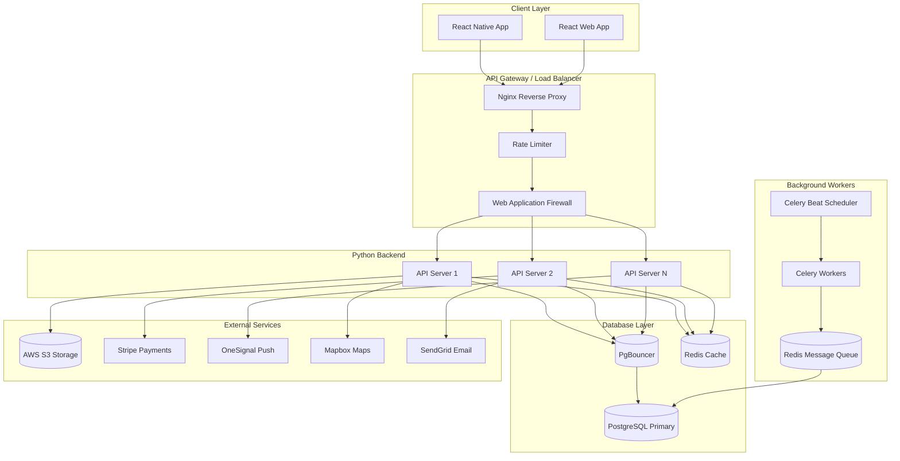
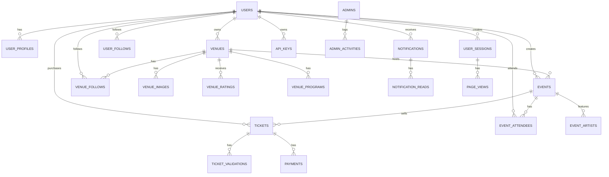
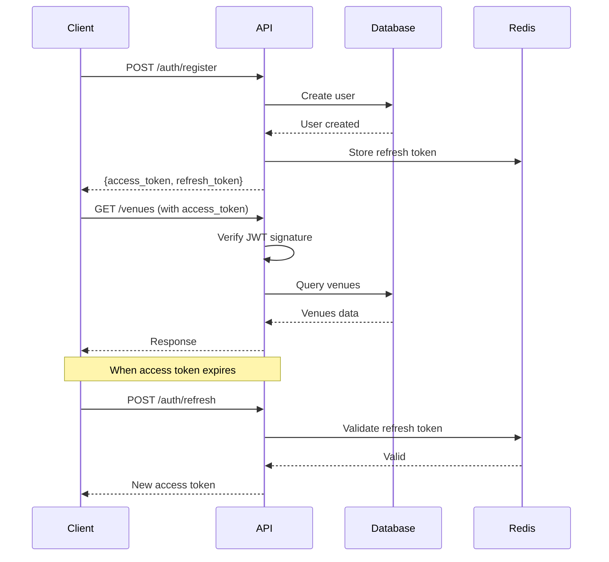

# YoVibe Backend Architecture & Database Design Plan
## (Python + PostgreSQL Implementation)

---

## Executive Summary

This document provides a comprehensive technical plan for designing and implementing a complete backend infrastructure for the YoVibe application - a nightlife and entertainment discovery platform. The plan uses **Python** as the backend language with **PostgreSQL** as the primary database, replacing the current Firebase/Firestore approach.

---

## 1. Project Overview Analysis

### 1.1 Current State (To Be Replaced)

The current YoVibe application uses:
- **Firebase Firestore** - NoSQL document database
- **Firebase Auth** - Authentication
- **Firebase Cloud Functions** - Serverless functions
- **Firebase Cloud Messaging** - Push notifications
- **Netlify** - Hosting and some serverless functions

### 1.2 Target Architecture

```
Current (Firebase)          →    Target (Python + PostgreSQL)
─────────────────────────────────────────────────────────────
Firestore                   →    PostgreSQL
Firebase Auth               →    Custom JWT + OAuth
Firebase Cloud Functions    →    FastAPI/Django REST API
Firebase Storage            →    AWS S3 / Cloudflare R2
FCM                         →    Twilio / OneSignal
Firebase Analytics          →    Custom Analytics + Grafana
```

---

## 2. Recommended Technology Stack

### 2.1 Backend Stack

| Component | Technology | Version | Rationale |
|-----------|------------|---------|-----------|
| **Framework** | FastAPI | 0.109+ | High performance, auto-docs, async support |
| **ORM** | SQLAlchemy | 2.0+ | Mature, type-safe, database agnostic |
| **Migration** | Alembic | 1.13+ | Version control for DB schema |
| **Authentication** | python-jose + Passlib | Latest | JWT tokens, OAuth2 support |
| **Validation** | Pydantic | 2.0+ | Data validation, serialization |
| **Task Queue** | Celery + Redis | Latest | Background jobs, scheduling |
| **API Documentation** | Swagger/OpenAPI | 3.0 | Auto-generated docs |
| **Testing** | Pytest | 7.0+ | Comprehensive testing |
| **Linting** | Ruff | Latest | Fast linting and formatting |

### 2.2 Database Stack

| Component | Technology | Rationale |
|-----------|------------|-----------|
| **Primary Database** | PostgreSQL 16+ | ACID compliance, complex queries |
| **Connection Pool** | PgBouncer | Connection management |
| **Search** | PostgreSQL Full-Text | Native text search + pgvector |
| **Caching** | Redis | Session cache, rate limiting |
| **Backup** | WAL-G | Point-in-time recovery |
| **GIS** | PostGIS | Geospatial queries for nearby venues |

### 2.3 Infrastructure Stack

| Component | Technology | Purpose |
|-----------|------------|---------|
| **Cloud Provider** | AWS / DigitalOcean / GCP | Hosting |
| **Container** | Docker + Docker Compose | Development & Deployment |
| **Orchestration** | Kubernetes / Railway / Render | Auto-scaling |
| **Storage** | AWS S3 / Cloudflare R2 | File uploads |
| **Push Notifications** | OneSignal / FCM | Mobile notifications |
| **Maps** | Mapbox | Venue mapping & directions |
| **Payments** | Stripe | Payment processing |
| **Email** | SendGrid / Resend | Transactional emails |
| **Analytics** | Grafana + Prometheus | Monitoring & analytics |

### 2.4 Architecture Diagram



---

## 3. Database Schema Design

### 3.1 Entity Relationship Diagram



### 3.2 Database Tables

#### A. Users Table

```sql
-- users table
CREATE TABLE users (
    -- Identity
    id UUID PRIMARY KEY DEFAULT gen_random_uuid(),
    uid VARCHAR(255) UNIQUE NOT NULL,           -- Auth provider ID
    email VARCHAR(255) UNIQUE NOT NULL,
    password_hash VARCHAR(255),                 -- Nullable for OAuth
    display_name VARCHAR(100),
    photo_url TEXT,
    
    -- Role & Permissions
    user_type user_type_enum DEFAULT 'user',    -- 'user', 'club_owner', 'admin'
    role VARCHAR(50) DEFAULT 'member',          -- 'member', 'moderator', 'admin', 'super_admin'
    is_active BOOLEAN DEFAULT true,
    is_verified BOOLEAN DEFAULT false,
    is_frozen BOOLEAN DEFAULT false,
    frozen_at TIMESTAMP WITH TIME ZONE,
    frozen_reason TEXT,
    deleted_at TIMESTAMP WITH TIME ZONE,
    
    -- Profile
    bio TEXT,
    phone_number VARCHAR(20),
    date_of_birth DATE,
    gender gender_enum,
    city VARCHAR(100),
    coordinates POINT,                          -- PostGIS for location
    
    -- Club Owner
    venue_id UUID REFERENCES venues(id),
    
    -- OAuth
    auth_provider VARCHAR(20),                  -- 'email', 'google', 'facebook'
    oauth_provider_id TEXT,
    
    -- Preferences
    notification_preferences JSONB DEFAULT '{"event_reminders": true, "nearby_venues": true, "friend_activities": true, "promotions": true}',
    theme VARCHAR(10) DEFAULT 'system',
    language VARCHAR(10) DEFAULT 'en',
    
    -- Timestamps
    created_at TIMESTAMP WITH TIME ZONE DEFAULT NOW(),
    updated_at TIMESTAMP WITH TIME ZONE DEFAULT NOW(),
    last_login_at TIMESTAMP WITH TIME ZONE,
    last_activity_at TIMESTAMP WITH TIME ZONE,
    
    -- Constraints
    CONSTRAINT valid_email CHECK (email ~* '^[A-Za-z0-9._%+-]+@[A-Za-z0-9.-]+\.[A-Za-z]{2,}$')
);

CREATE INDEX idx_users_email ON users(email);
CREATE INDEX idx_users_uid ON users(uid);
CREATE INDEX idx_users_user_type ON users(user_type);
CREATE INDEX idx_users_venue_id ON users(venue_id) WHERE venue_id IS NOT NULL;
CREATE INDEX idx_users_location ON users USING GIST(coordinates);
CREATE INDEX idx_users_created_at ON users(created_at);

-- Enum types
CREATE TYPE user_type_enum AS ENUM ('user', 'club_owner', 'admin');
CREATE TYPE gender_enum AS ENUM ('male', 'female', 'other', 'prefer_not_to_say');
```

#### B. Venues Table

```sql
-- venues table
CREATE TABLE venues (
    -- Identity
    id UUID PRIMARY KEY DEFAULT gen_random_uuid(),
    slug VARCHAR(100) UNIQUE NOT NULL,          -- URL-friendly
    name VARCHAR(200) NOT NULL,
    description TEXT,
    
    -- Location (PostGIS)
    location POINT NOT NULL,                    -- lat/lng
    address_line1 VARCHAR(255),
    address_line2 VARCHAR(255),
    city VARCHAR(100) NOT NULL,
    district VARCHAR(100),
    country VARCHAR(100) DEFAULT 'Uganda',
    location_name VARCHAR(200),                 -- Human-readable
    
    -- Media
    background_image_url TEXT,
    cover_image_url TEXT,
    gallery_images JSONB DEFAULT '[]',
    
    -- Categories & Tags
    categories VARCHAR(50)[] DEFAULT '{}',
    tags VARCHAR(50)[] DEFAULT '{}',
    
    -- Vibe & Rating
    vibe_rating DECIMAL(3,2) DEFAULT 0,
    total_ratings INTEGER DEFAULT 0,
    average_rating DECIMAL(3,2) DEFAULT 0,
    today_images JSONB DEFAULT '[]',             -- User-submitted
    
    -- Pricing
    price_range SMALLINT CHECK (price_range BETWEEN 1 AND 4),
    cover_charge INTEGER,                       -- In UGX
    
    -- Venue Type
    venue_type venue_type_enum DEFAULT 'nightlife',  -- 'nightlife', 'recreation', 'restaurant', 'lounge'
    
    -- Owner
    owner_id UUID NOT NULL REFERENCES users(id),
    owner_name VARCHAR(100),
    owner_contact JSONB,
    
    -- Features (JSON for flexibility)
    features JSONB DEFAULT '{"vipSection": false, "outdoorSeating": false, "liveMusic": false}',
    
    -- Schedule
    opening_hours JSONB,                         -- Day-by-day schedule
    weekly_programs JSONB DEFAULT '{}',
    
    -- Status
    is_verified BOOLEAN DEFAULT false,
    is_featured BOOLEAN DEFAULT false,
    is_active BOOLEAN DEFAULT true,
    
    -- Stats
    follower_count INTEGER DEFAULT 0,
    event_count INTEGER DEFAULT 0,
    check_in_count INTEGER DEFAULT 0,
    
    -- Search (Full-Text)
    search_vector TSVECTOR,
    
    -- Timestamps
    created_at TIMESTAMP WITH TIME ZONE DEFAULT NOW(),
    updated_at TIMESTAMP WITH TIME ZONE DEFAULT NOW(),
    last_event_at TIMESTAMP WITH TIME ZONE,
    
    -- Constraints
    CONSTRAINT valid_coordinates CHECK (
        ST_Y(location) BETWEEN -90 AND 90 AND
        ST_X(location) BETWEEN -180 AND 180
    )
);

CREATE INDEX idx_venues_slug ON venues(slug);
CREATE INDEX idx_venues_owner_id ON venues(owner_id);
CREATE INDEX idx_venues_location ON venues USING GIST(location);
CREATE INDEX idx_venues_city ON venues(city);
CREATE INDEX idx_venues_venue_type ON venues(venue_type);
CREATE INDEX idx_venues_is_featured ON venues(is_featured) WHERE is_featured = true;
CREATE INDEX idx_venues_is_active ON venues(is_active) WHERE is_active = true;
CREATE INDEX idx_venues_search ON venues USING GIN(search_vector);

-- Enable PostGIS
CREATE EXTENSION IF NOT EXISTS postgis;

-- Trigger for search vector
CREATE TRIGGER venues_search_update
    BEFORE INSERT OR UPDATE ON venues
    FOR EACH ROW
    EXECUTE FUNCTION tsvector_update_trigger('search_vector', 'pg_catalog.english', 'name', 'description', 'city');
```

#### C. Events Table

```sql
-- events table
CREATE TABLE events (
    -- Identity
    id UUID PRIMARY KEY DEFAULT gen_random_uuid(),
    slug VARCHAR(100) UNIQUE NOT NULL,
    name VARCHAR(200) NOT NULL,
    description TEXT,
    
    -- Venue
    venue_id UUID NOT NULL REFERENCES venues(id),
    venue_name VARCHAR(200),
    venue_location VARCHAR(200),
    
    -- Date & Time
    start_date DATE NOT NULL,
    end_date DATE,
    start_time TIME NOT NULL,
    end_time TIME,
    is_recurring BOOLEAN DEFAULT false,
    recurring_pattern JSONB,                     -- Frequency, interval, etc.
    
    -- Media
    poster_image_url TEXT,
    banner_image_url TEXT,
    gallery_images JSONB DEFAULT '[]',
    
    -- Pricing
    is_free_entry BOOLEAN DEFAULT false,
    price_min INTEGER,
    price_max INTEGER,
    currency VARCHAR(3) DEFAULT 'UGX',
    entry_fees JSONB DEFAULT '[]',               -- Early bird, VIP, etc.
    
    -- Ticket Contacts
    ticket_contacts JSONB DEFAULT '[]',
    
    -- Content
    age_restriction VARCHAR(20),
    dress_code VARCHAR(100),
    
    -- Engagement
    is_featured BOOLEAN DEFAULT false,
    attendee_count INTEGER DEFAULT 0,
    interested_count INTEGER DEFAULT 0,
    status event_status_enum DEFAULT 'draft',    -- 'draft', 'published', 'cancelled', 'postponed', 'sold_out'
    
    -- Creator
    created_by UUID NOT NULL REFERENCES users(id),
    created_by_type user_type_enum,
    
    -- Search
    search_vector TSVECTOR,
    
    -- Timestamps
    created_at TIMESTAMP WITH TIME ZONE DEFAULT NOW(),
    updated_at TIMESTAMP WITH TIME ZONE DEFAULT NOW(),
    published_at TIMESTAMP WITH TIME ZONE,
    
    -- Constraints
    CONSTRAINT valid_dates CHECK (end_date IS NULL OR end_date >= start_date)
);

CREATE INDEX idx_events_slug ON events(slug);
CREATE INDEX idx_events_venue_id ON events(venue_id);
CREATE INDEX idx_events_start_date ON events(start_date);
CREATE INDEX idx_events_created_by ON events(created_by);
CREATE INDEX idx_events_status ON events(status);
CREATE INDEX idx_events_is_featured ON events(is_featured) WHERE is_featured = true;
CREATE INDEX idx_events_search ON events USING GIN(search_vector);

CREATE TYPE event_status_enum AS ENUM ('draft', 'published', 'cancelled', 'postponed', 'sold_out');

-- Event Artists
CREATE TABLE event_artists (
    id UUID PRIMARY KEY DEFAULT gen_random_uuid(),
    event_id UUID NOT NULL REFERENCES events(id) ON DELETE CASCADE,
    name VARCHAR(200) NOT NULL,
    artist_type VARCHAR(50) NOT NULL,            -- 'dj', 'band', 'singer', 'comedian', 'performer'
    image_url TEXT,
    bio TEXT,
    sort_order INTEGER DEFAULT 0,
    created_at TIMESTAMP WITH TIME ZONE DEFAULT NOW()
);

CREATE INDEX idx_event_artists_event_id ON event_artists(event_id);
```

#### D. Tickets Table

```sql
-- tickets table
CREATE TABLE tickets (
    -- Identity
    id UUID PRIMARY KEY DEFAULT gen_random_uuid(),
    ticket_number VARCHAR(20) UNIQUE NOT NULL,
    
    -- Event
    event_id UUID NOT NULL REFERENCES events(id),
    event_name VARCHAR(200),
    event_date DATE,
    event_time TIME,
    venue_id UUID REFERENCES venues(id),
    venue_name VARCHAR(200),
    ticket_type VARCHAR(50),                     -- 'Early Bird', 'VIP', 'General'
    entry_fee_id VARCHAR(50),
    
    -- Buyer
    buyer_id UUID NOT NULL REFERENCES users(id),
    buyer_name VARCHAR(100) NOT NULL,
    buyer_email VARCHAR(255) NOT NULL,
    buyer_phone VARCHAR(20),
    
    -- Quantity & Pricing
    quantity INTEGER NOT NULL DEFAULT 1,
    unit_price INTEGER NOT NULL,
    total_amount INTEGER NOT NULL,
    currency VARCHAR(3) DEFAULT 'UGX',
    
    -- Revenue Split
    venue_revenue INTEGER NOT NULL,
    app_commission INTEGER NOT NULL,
    platform_fee INTEGER DEFAULT 0,
    tax_amount INTEGER DEFAULT 0,
    
    -- Payment
    payment_id UUID REFERENCES payments(id),
    payment_status payment_status_enum DEFAULT 'pending',
    payment_method VARCHAR(50),
    paid_at TIMESTAMP WITH TIME ZONE,
    
    -- QR & Validation
    qr_code TEXT UNIQUE NOT NULL,
    qr_code_url TEXT,
    biometric_hash VARCHAR(255) NOT NULL,
    
    -- Status
    status ticket_status_enum DEFAULT 'active',  -- 'active', 'used', 'cancelled', 'expired', 'transferred'
    used_at TIMESTAMP WITH TIME ZONE,
    
    -- Transfer
    transferred_to UUID REFERENCES users(id),
    transferred_at TIMESTAMP WITH TIME ZONE,
    transfer_history JSONB DEFAULT '[]',
    
    -- Expiry
    expires_at TIMESTAMP WITH TIME ZONE,
    
    -- Timestamps
    created_at TIMESTAMP WITH TIME ZONE DEFAULT NOW(),
    updated_at TIMESTAMP WITH TIME ZONE DEFAULT NOW()
);

CREATE INDEX idx_tickets_ticket_number ON tickets(ticket_number);
CREATE INDEX idx_tickets_qr_code ON tickets(qr_code);
CREATE INDEX idx_tickets_event_id ON tickets(event_id);
CREATE INDEX idx_tickets_buyer_id ON tickets(buyer_id);
CREATE INDEX idx_tickets_payment_id ON tickets(payment_id);
CREATE INDEX idx_tickets_status ON tickets(status);

-- Ticket Validations
CREATE TABLE ticket_validations (
    id UUID PRIMARY KEY DEFAULT gen_random_uuid(),
    ticket_id UUID NOT NULL REFERENCES tickets(id) ON DELETE CASCADE,
    validated_at TIMESTAMP WITH TIME ZONE DEFAULT NOW(),
    validated_by UUID NOT NULL REFERENCES users(id),
    validator_name VARCHAR(100),
    location VARCHAR(200),
    biometric_match BOOLEAN NOT NULL,
    status validation_status_enum NOT NULL,
    reason TEXT
);

CREATE INDEX idx_ticket_validations_ticket_id ON ticket_validations(ticket_id);
CREATE INDEX idx_ticket_validations_validated_by ON ticket_validations(validated_by);

-- Payments
CREATE TABLE payments (
    id UUID PRIMARY KEY DEFAULT gen_random_uuid(),
    user_id UUID NOT NULL REFERENCES users(id),
    amount INTEGER NOT NULL,
    currency VARCHAR(3) DEFAULT 'UGX',
    status payment_status_enum DEFAULT 'pending',
    stripe_payment_intent_id VARCHAR(255),
    stripe_charge_id VARCHAR(255),
    payment_method VARCHAR(50),
    metadata JSONB DEFAULT '{}',
    created_at TIMESTAMP WITH TIME ZONE DEFAULT NOW(),
    completed_at TIMESTAMP WITH TIME ZONE,
    failed_at TIMESTAMP WITH TIME ZONE,
    failure_reason TEXT
);

CREATE INDEX idx_payments_user_id ON payments(user_id);
CREATE INDEX idx_payments_stripe_id ON payments(stripe_payment_intent_id);
CREATE INDEX idx_payments_status ON payments(status);

CREATE TYPE ticket_status_enum AS ENUM ('active', 'used', 'cancelled', 'expired', 'transferred');
CREATE TYPE payment_status_enum AS ENUM ('pending', 'processing', 'succeeded', 'failed', 'refunded', 'partially_refunded');
CREATE TYPE validation_status_enum AS ENUM ('granted', 'denied');
```

#### E. Notifications Table

```sql
-- notifications table
CREATE TABLE notifications (
    -- Identity
    id UUID PRIMARY KEY DEFAULT gen_random_uuid(),
    
    -- Target
    user_id UUID REFERENCES users(id),           -- NULL for broadcast
    target_segments VARCHAR(50)[],               -- ['all', 'club_owners', etc.]
    
    -- Content
    type notification_type_enum NOT NULL,
    title VARCHAR(200) NOT NULL,
    body TEXT NOT NULL,
    short_body VARCHAR(100),
    
    -- Media
    image_url TEXT,
    icon_url TEXT,
    
    -- Deep Linking
    deep_link VARCHAR(500),
    web_link VARCHAR(500),
    data JSONB DEFAULT '{}',
    
    -- Delivery
    delivery_status delivery_status_enum DEFAULT 'pending',
    scheduled_for TIMESTAMP WITH TIME ZONE,
    sent_at TIMESTAMP WITH TIME ZONE,
    delivered_at TIMESTAMP WITH TIME ZONE,
    
    -- Priority
    priority priority_enum DEFAULT 'normal',
    
    -- Creator
    created_by UUID REFERENCES users(id),
    
    -- Expiry
    expires_at TIMESTAMP WITH TIME ZONE,
    
    -- Timestamps
    created_at TIMESTAMP WITH TIME ZONE DEFAULT NOW()
);

CREATE INDEX idx_notifications_user_id ON notifications(user_id);
CREATE INDEX idx_notifications_type ON notifications(type);
CREATE INDEX idx_notifications_created_at ON notifications(created_at);
CREATE INDEX idx_notifications_scheduled_for ON notifications(scheduled_for) WHERE scheduled_for IS NOT NULL;

-- Notification Reads
CREATE TABLE notification_reads (
    notification_id UUID NOT NULL REFERENCES notifications(id) ON DELETE CASCADE,
    user_id UUID NOT NULL REFERENCES users(id),
    read_at TIMESTAMP WITH TIME ZONE DEFAULT NOW(),
    opened_at TIMESTAMP WITH TIME ZONE,
    PRIMARY KEY (notification_id, user_id)
);

CREATE INDEX idx_notification_reads_user_id ON notification_reads(user_id);

-- FCM Tokens
CREATE TABLE fcm_tokens (
    id UUID PRIMARY KEY DEFAULT gen_random_uuid(),
    token VARCHAR(500) UNIQUE NOT NULL,
    user_id UUID REFERENCES users(id),           -- NULL for anonymous
    
    -- Device Info
    platform VARCHAR(20) NOT NULL,
    browser VARCHAR(50),
    browser_version VARCHAR(20),
    os VARCHAR(50),
    os_version VARCHAR(20),
    device_model VARCHAR(100),
    device_id VARCHAR(100),
    app_version VARCHAR(20),
    
    -- Location
    city VARCHAR(100),
    country VARCHAR(100),
    coordinates POINT,
    
    -- Status
    is_active BOOLEAN DEFAULT true,
    last_active_at TIMESTAMP WITH TIME ZONE DEFAULT NOW(),
    unsubscribed_at TIMESTAMP WITH TIME ZONE,
    
    -- Preferences
    preferences JSONB DEFAULT '{"eventReminders": true, "nearbyVenues": true, "promotions": true}',
    
    -- Timestamps
    created_at TIMESTAMP WITH TIME ZONE DEFAULT NOW()
);

CREATE INDEX idx_fcm_tokens_token ON fcm_tokens(token);
CREATE INDEX idx_fcm_tokens_user_id ON fcm_tokens(user_id) WHERE user_id IS NOT NULL;
CREATE INDEX idx_fcm_tokens_platform ON fcm_tokens(platform);
CREATE INDEX idx_fcm_tokens_is_active ON fcm_tokens(is_active) WHERE is_active = true;

CREATE TYPE notification_type_enum AS ENUM (
    'event_summary', 'ticket_purchase', 'ticket_validation', 
    'payment_confirmation', 'event_reminder', 'welcome', 
    'upcoming_summary', 'venue_update', 'promotion', 'system'
);
CREATE TYPE delivery_status_enum AS ENUM ('pending', 'sent', 'delivered', 'failed');
CREATE TYPE priority_enum AS ENUM ('low', 'normal', 'high', 'urgent');
```

#### F. Analytics Tables

```sql
-- User Sessions
CREATE TABLE user_sessions (
    id UUID PRIMARY KEY DEFAULT gen_random_uuid(),
    
    -- User Identification
    user_id UUID REFERENCES users(id),          -- NULL for anonymous
    unique_visitor_id UUID NOT NULL,
    is_authenticated BOOLEAN DEFAULT false,
    
    -- Session Data
    started_at TIMESTAMP WITH TIME ZONE DEFAULT NOW(),
    ended_at TIMESTAMP WITH TIME ZONE,
    duration_seconds INTEGER,
    
    -- Platform & Device
    platform VARCHAR(20) NOT NULL,
    device_type VARCHAR(50),
    browser VARCHAR(50),
    os VARCHAR(50),
    screen_width INTEGER,
    screen_height INTEGER,
    user_agent TEXT,
    
    -- Location
    city VARCHAR(100),
    country VARCHAR(100),
    coordinates POINT,
    
    -- Engagement
    page_views INTEGER DEFAULT 0,
    events_triggered JSONB DEFAULT '[]',
    
    -- Referrer
    referrer TEXT,
    utm_source VARCHAR(100),
    utm_medium VARCHAR(100),
    utm_campaign VARCHAR(100),
    
    -- Timestamps
    created_at TIMESTAMP WITH TIME ZONE DEFAULT NOW()
);

CREATE INDEX idx_sessions_user_id ON user_sessions(user_id);
CREATE INDEX idx_sessions_visitor_id ON user_sessions(unique_visitor_id);
CREATE INDEX idx_sessions_started_at ON user_sessions(started_at);
CREATE INDEX idx_sessions_platform ON user_sessions(platform);

-- Page Views
CREATE TABLE page_views (
    id UUID PRIMARY KEY DEFAULT gen_random_uuid(),
    session_id UUID NOT NULL REFERENCES user_sessions(id) ON DELETE CASCADE,
    user_id UUID REFERENCES users(id),
    page_name VARCHAR(100) NOT NULL,
    page_path VARCHAR(500) NOT NULL,
    duration_seconds INTEGER,
    referrer TEXT,
    utm_params JSONB,
    created_at TIMESTAMP WITH TIME ZONE DEFAULT NOW()
);

CREATE INDEX idx_page_views_session_id ON page_views(session_id);
CREATE INDEX idx_page_views_user_id ON page_views(user_id);
CREATE INDEX idx_page_views_created_at ON page_views(created_at);

-- Daily Analytics
CREATE TABLE daily_analytics (
    id UUID PRIMARY KEY DEFAULT gen_random_uuid(),
    date DATE NOT NULL UNIQUE,
    
    -- User Stats
    total_sessions INTEGER DEFAULT 0,
    authenticated_sessions INTEGER DEFAULT 0,
    anonymous_sessions INTEGER DEFAULT 0,
    new_users INTEGER DEFAULT 0,
    returning_users INTEGER DEFAULT 0,
    unique_visitors INTEGER DEFAULT 0,
    
    -- Engagement
    total_page_views INTEGER DEFAULT 0,
    avg_session_duration INTEGER DEFAULT 0,
    bounce_rate DECIMAL(5,2) DEFAULT 0,
    
    -- Venue Stats
    venue_views INTEGER DEFAULT 0,
    venue_searches INTEGER DEFAULT 0,
    venue_follows INTEGER DEFAULT 0,
    
    -- Event Stats
    event_views INTEGER DEFAULT 0,
    event_searches INTEGER DEFAULT 0,
    event_attendees INTEGER DEFAULT 0,
    
    -- Ticket Stats
    tickets_purchased INTEGER DEFAULT 0,
    ticket_revenue INTEGER DEFAULT 0,
    
    -- Notification Stats
    notifications_sent INTEGER DEFAULT 0,
    notifications_opened INTEGER DEFAULT 0,
    notification_open_rate DECIMAL(5,2) DEFAULT 0,
    
    -- Timestamps
    created_at TIMESTAMP WITH TIME ZONE DEFAULT NOW(),
    updated_at TIMESTAMP WITH TIME ZONE DEFAULT NOW()
);

CREATE INDEX idx_daily_analytics_date ON daily_analytics(date);
```

#### G. Social Features Tables

```sql
-- User Follows
CREATE TABLE user_follows (
    follower_id UUID NOT NULL REFERENCES users(id) ON DELETE CASCADE,
    following_id UUID NOT NULL REFERENCES users(id) ON DELETE CASCADE,
    created_at TIMESTAMP WITH TIME ZONE DEFAULT NOW(),
    PRIMARY KEY (follower_id, following_id)
);

CREATE INDEX idx_user_follows_follower ON user_follows(follower_id);
CREATE INDEX idx_user_follows_following ON user_follows(following_id);

-- Venue Followers
CREATE TABLE venue_followers (
    venue_id UUID NOT NULL REFERENCES venues(id) ON DELETE CASCADE,
    user_id UUID NOT NULL REFERENCES users(id) ON DELETE CASCADE,
    notification_preferences JSONB DEFAULT '{"all": true}',
    created_at TIMESTAMP WITH TIME ZONE DEFAULT NOW(),
    PRIMARY KEY (venue_id, user_id)
);

CREATE INDEX idx_venue_followers_venue ON venue_followers(venue_id);
CREATE INDEX idx_venue_followers_user ON venue_followers(user_id);

-- Event Attendees
CREATE TABLE event_attendees (
    event_id UUID NOT NULL REFERENCES events(id) ON DELETE CASCADE,
    user_id UUID NOT NULL REFERENCES users(id) ON DELETE CASCADE,
    status attendee_status_enum DEFAULT 'interested',  -- 'interested', 'going', 'not_going'
    created_at TIMESTAMP WITH TIME ZONE DEFAULT NOW(),
    updated_at TIMESTAMP WITH TIME ZONE DEFAULT NOW(),
    PRIMARY KEY (event_id, user_id)
);

CREATE INDEX idx_event_attendees_event ON event_attendees(event_id);
CREATE INDEX idx_event_attendees_user ON event_attendees(user_id);

CREATE TYPE attendee_status_enum AS ENUM ('interested', 'going', 'not_going');

-- Venue Ratings
CREATE TABLE venue_ratings (
    id UUID PRIMARY KEY DEFAULT gen_random_uuid(),
    venue_id UUID NOT NULL REFERENCES venues(id) ON DELETE CASCADE,
    user_id UUID NOT NULL REFERENCES users(id) ON DELETE CASCADE,
    rating SMALLINT NOT NULL CHECK (rating BETWEEN 1 AND 5),
    review TEXT,
    created_at TIMESTAMP WITH TIME ZONE DEFAULT NOW(),
    updated_at TIMESTAMP WITH TIME ZONE DEFAULT NOW(),
    UNIQUE(venue_id, user_id)
);

CREATE INDEX idx_venue_ratings_venue ON venue_ratings(venue_id);
CREATE INDEX idx_venue_ratings_user ON venue_ratings(user_id);

-- Reports
CREATE TABLE reports (
    id UUID PRIMARY KEY DEFAULT gen_random_uuid(),
    
    -- Report Type
    report_type report_type_enum NOT NULL,
    
    -- Target
    target_type VARCHAR(50) NOT NULL,
    target_id UUID NOT NULL,
    
    -- Reporter
    reporter_id UUID NOT NULL REFERENCES users(id),
    
    -- Content
    reason VARCHAR(50) NOT NULL,
    description TEXT,
    evidence_urls TEXT[],
    
    -- Status
    status report_status_enum DEFAULT 'pending',
    resolved_by UUID REFERENCES users(id),
    resolution TEXT,
    resolved_at TIMESTAMP WITH TIME ZONE,
    
    -- Timestamps
    created_at TIMESTAMP WITH TIME ZONE DEFAULT NOW()
);

CREATE INDEX idx_reports_target ON reports(target_type, target_id);
CREATE INDEX idx_reports_reporter ON reports(reporter_id);
CREATE INDEX idx_reports_status ON reports(status);

CREATE TYPE report_type_enum AS ENUM ('venue', 'event', 'user', 'comment', 'review');
CREATE TYPE report_status_enum AS ENUM ('pending', 'investigating', 'resolved', 'dismissed');
```

#### H. API Management Tables

```sql
-- API Keys
CREATE TABLE api_keys (
    id UUID PRIMARY KEY DEFAULT gen_random_uuid(),
    key_hash VARCHAR(255) NOT NULL UNIQUE,
    user_id UUID NOT NULL REFERENCES users(id) ON DELETE CASCADE,
    name VARCHAR(100) NOT NULL,
    permissions VARCHAR(50)[] DEFAULT '{}',
    rate_limit INTEGER DEFAULT 100,
    is_active BOOLEAN DEFAULT true,
    expires_at TIMESTAMP WITH TIME ZONE,
    last_used_at TIMESTAMP WITH TIME ZONE,
    created_at TIMESTAMP WITH TIME ZONE DEFAULT NOW()
);

CREATE INDEX idx_api_keys_user ON api_keys(user_id);
CREATE INDEX idx_api_keys_key_hash ON api_keys(key_hash);

-- Rate Limiting
CREATE TABLE rate_limits (
    identifier VARCHAR(255) NOT NULL,
    endpoint VARCHAR(100) NOT NULL,
    window_start TIMESTAMP WITH TIME ZONE NOT NULL,
    window_end TIMESTAMP WITH TIME ZONE NOT NULL,
    request_count INTEGER DEFAULT 0,
    PRIMARY KEY (identifier, endpoint, window_start)
);

-- Admin Activities
CREATE TABLE admin_activities (
    id UUID PRIMARY KEY DEFAULT gen_random_uuid(),
    admin_id UUID NOT NULL REFERENCES users(id),
    action VARCHAR(100) NOT NULL,
    target_type VARCHAR(50),
    target_id UUID,
    old_value JSONB,
    new_value JSONB,
    ip_address INET,
    user_agent TEXT,
    created_at TIMESTAMP WITH TIME ZONE DEFAULT NOW()
);

CREATE INDEX idx_admin_activities_admin ON admin_activities(admin_id);
CREATE INDEX idx_admin_activities_created ON admin_activities(created_at);
```

---

## 4. API Endpoints Design

### 4.1 REST API Structure

```
Base URL: https://api.yovibe.app/v1
```

#### Authentication Endpoints

| Method | Endpoint | Description | Auth Required |
|--------|----------|-------------|---------------|
| POST | `/auth/register` | Register with email/password | No |
| POST | `/auth/login` | Login with credentials | No |
| POST | `/auth/logout` | Invalidate token | Yes |
| POST | `/auth/refresh` | Refresh access token | Yes |
| POST | `/auth/forgot-password` | Request password reset | No |
| POST | `/auth/reset-password` | Reset with token | No |
| POST | `/auth/verify-email` | Verify email address | No |
| GET | `/auth/me` | Get current user | Yes |
| PUT | `/auth/profile` | Update profile | Yes |
| PUT | `/auth/password` | Change password | Yes |
| DELETE | `/auth/account` | Delete account | Yes |
| POST | `/auth/oauth/{provider}` | OAuth login | No |

#### User Endpoints

| Method | Endpoint | Description | Auth Required |
|--------|----------|-------------|---------------|
| GET | `/users` | List users | Admin |
| GET | `/users/{id}` | Get user profile | Optional |
| PUT | `/users/{id}` | Update user | Owner/Admin |
| DELETE | `/users/{id}` | Delete user | Owner/Admin |
| POST | `/users/{id}/follow` | Follow user | Yes |
| DELETE | `/users/{id}/follow` | Unfollow user | Yes |
| GET | `/users/{id}/followers` | Get followers | Optional |
| GET | `/users/{id}/following` | Get following | Optional |
| GET | `/users/{id}/tickets` | Get user's tickets | Owner |
| GET | `/users/{id}/venues` | Get user's venues | Owner |
| GET | `/users/me/sessions` | Get login history | Yes |

#### Venue Endpoints

| Method | Endpoint | Description | Auth Required |
|--------|----------|-------------|---------------|
| GET | `/venues` | List venues | No |
| GET | `/venues/search` | Search venues | No |
| GET | `/venues/nearby` | Get nearby venues | No |
| GET | `/venues/featured` | Featured venues | No |
| GET | `/venues/{id}` | Get venue details | No |
| POST | `/venues` | Create venue | Club Owner |
| PUT | `/venues/{id}` | Update venue | Owner/Admin |
| DELETE | `/venues/{id}` | Delete venue | Owner/Admin |
| GET | `/venues/{id}/events` | Get venue events | No |
| GET | `/venues/{id}/images` | Get venue images | No |
| POST | `/venues/{id}/images` | Upload image | Yes |
| POST | `/venues/{id}/rate` | Rate venue | Yes |
| POST | `/venues/{id}/follow` | Follow venue | Yes |
| DELETE | `/venues/{id}/follow` | Unfollow venue | Yes |
| GET | `/venues/{id}/analytics` | Get analytics | Owner |
| PUT | `/venues/{id}/programs` | Update programs | Owner |

#### Event Endpoints

| Method | Endpoint | Description | Auth Required |
|--------|----------|-------------|---------------|
| GET | `/events` | List events | No |
| GET | `/events/search` | Search events | No |
| GET | `/events/calendar` | Calendar view | No |
| GET | `/events/featured` | Featured events | No |
| GET | `/events/upcoming` | Upcoming events | No |
| GET | `/events/{id}` | Get event details | No |
| POST | `/events` | Create event | Club Owner/Admin |
| PUT | `/events/{id}` | Update event | Owner/Admin |
| DELETE | `/events/{id}` | Delete event | Owner/Admin |
| POST | `/events/{id}/attend` | Mark attending | Yes |
| DELETE | `/events/{id}/attend` | Remove attendance | Yes |
| GET | `/events/{id}/attendees` | Get attendees | Owner |
| POST | `/events/{id}/share` | Share event | Yes |

#### Ticket Endpoints

| Method | Endpoint | Description | Auth Required |
|--------|----------|-------------|---------------|
| POST | `/tickets/purchase` | Purchase ticket | Yes |
| GET | `/tickets/{id}` | Get ticket | Owner |
| GET | `/tickets/{id}/qr` | Get QR image | Owner |
| POST | `/tickets/{id}/validate` | Validate ticket | Staff |
| POST | `/tickets/{id}/transfer` | Transfer ticket | Owner |
| POST | `/tickets/{id}/refund` | Request refund | Owner |
| GET | `/tickets/user/{userId}` | User's tickets | Owner |
| GET | `/tickets/event/{eventId}` | Event's tickets | Owner |

#### Notification Endpoints

| Method | Endpoint | Description | Auth Required |
|--------|----------|-------------|---------------|
| GET | `/notifications` | List notifications | Yes |
| GET | `/notifications/unread` | Unread count | Yes |
| PUT | `/notifications/{id}/read` | Mark as read | Yes |
| PUT | `/notifications/read-all` | Mark all read | Yes |
| DELETE | `/notifications/{id}` | Delete | Yes |
| POST | `/notifications/tokens` | Register FCM | Yes |
| DELETE | `/notifications/tokens/{token}` | Remove token | Yes |
| POST | `/notifications/broadcast` | Send broadcast | Admin |

#### Analytics Endpoints

| Method | Endpoint | Description | Auth Required |
|--------|----------|-------------|---------------|
| GET | `/analytics/overview` | Dashboard | Admin |
| GET | `/analytics/users` | User analytics | Admin |
| GET | `/analytics/venues` | Venue analytics | Admin |
| GET | `/analytics/events` | Event analytics | Admin |
| GET | `/analytics/tickets` | Ticket analytics | Admin |
| GET | `/analytics/revenue` | Revenue analytics | Admin |
| GET | `/analytics/realtime` | Live analytics | Admin |
| GET | `/analytics/sessions` | Session data | Admin |

### 4.2 GraphQL Alternative (Optional)

```graphql
type Query {
    # Users
    user(id: ID!): User
    users(limit: Int, offset: Int, userType: UserType): [User!]!
    me: User
    
    # Venues
    venue(id: ID!): Venue
    venues(filter: VenueFilter, limit: Int, offset: Int): VenueConnection!
    nearbyVenues(lat: Float!, lng: Float!, radius: Int!): [Venue!]!
    featuredVenues: [Venue!]!
    
    # Events
    event(id: ID!): Event
    events(filter: EventFilter, limit: Int, offset: Int): EventConnection!
    upcomingEvents(limit: Int): [Event!]!
    calendarEvents(startDate: Date!, endDate: Date!): [Event!]!
    
    # Tickets
    ticket(id: ID!): Ticket
    myTickets: [Ticket!]!
}

type Mutation {
    # Auth
    register(input: RegisterInput!): AuthPayload!
    login(input: LoginInput!): AuthPayload!
    
    # Venues
    createVenue(input: VenueInput!): Venue!
    updateVenue(id: ID!, input: VenueInput!): Venue!
    deleteVenue(id: ID!): Boolean!
    
    # Events
    createEvent(input: EventInput!): Event!
    updateEvent(id: ID!, input: EventInput!): Event!
    deleteEvent(id: ID!): Boolean!
    
    # Tickets
    purchaseTicket(input: PurchaseTicketInput!): Ticket!
    validateTicket(ticketId: ID!, biometricData: String!): ValidationResult!
}
```

---

## 5. Authentication & Security

### 5.1 JWT Token Structure

```python
# Token Payloads
class TokenPayload(BaseModel):
    # Access Token
    sub: str = Field(..., description="User ID")
    email: str
    user_type: str
    role: str
    exp: datetime
    iat: datetime
    type: str = "access"
    
    # Refresh Token
    type: str = "refresh"
    jti: str  # Token ID for revocation
```

### 5.2 Authentication Flow



### 5.3 Password Security

```python
# Password hashing configuration
PASSWORD_CONFIG = {
    "schemes": ["bcrypt"],
    "bcrypt__rounds": 12,
    "deprecated": "auto"
}

# Password validation
class PasswordStrength:
    MIN_LENGTH = 8
    REQUIRE_UPPERCASE = True
    REQUIRE_LOWERCASE = True
    REQUIRE_DIGITS = True
    REQUIRE_SPECIAL = True
    
    @classmethod
    def validate(cls, password: str) -> tuple[bool, str]:
        # Validation logic
        pass
```

### 5.4 Rate Limiting

```python
# Rate limit configuration
RATE_LIMITS = {
    # Auth endpoints (stricter)
    "auth": {"requests": 10, "window": 60},        # 10/min
    "auth:login": {"requests": 5, "window": 60},    # 5/min
    
    # API endpoints
    "default": {"requests": 100, "window": 60},     # 100/min
    "read": {"requests": 200, "window": 60},        # 200/min
    
    # Sensitive operations
    "payment": {"requests": 20, "window": 3600},    # 20/hour
    "ticket_purchase": {"requests": 10, "window": 3600}
}
```

---

## 6. Backend Service Architecture

### 6.1 Project Structure

```
yovibe-backend/
├── app/
│   ├── __init__.py
│   ├── main.py                    # FastAPI application
│   ├── config.py                  # Configuration
│   ├── dependencies.py             # Dependency injection
│   ├── exceptions.py              # Custom exceptions
│   └── logging_config.py          # Logging setup
│
├── api/
│   ├── __init__.py
│   └── v1/
│       ├── __init__.py
│       ├── routes/
│       │   ├── __init__.py
│       │   ├── auth.py
│       │   ├── users.py
│       │   ├── venues.py
│       │   ├── events.py
│       │   ├── tickets.py
│       │   ├── notifications.py
│       │   ├── analytics.py
│       │   └── search.py
│       └── schemas/              # Pydantic models
│           ├── __init__.py
│           ├── user.py
│           ├── venue.py
│           ├── event.py
│           ├── ticket.py
│           └── notification.py
│
├── core/
│   ├── __init__.py
│   ├── security.py               # JWT, password hashing
│   ├── permissions.py            # RBAC
│   ├── rate_limiting.py          # Rate limiting
│   └── pagination.py             # Pagination helpers
│
├── models/
│   ├── __init__.py
│   ├── user.py
│   ├── venue.py
│   ├── event.py
│   ├── ticket.py
│   └── notification.py
│
├── services/
│   ├── __init__.py
│   ├── auth_service.py
│   ├── user_service.py
│   ├── venue_service.py
│   ├── event_service.py
│   ├── ticket_service.py
│   ├── notification_service.py
│   ├── payment_service.py
│   ├── push_notification_service.py
│   ├── email_service.py
│   ├── analytics_service.py
│   └── search_service.py
│
├── tasks/
│   ├── __init__.py
│   ├── celery_app.py
│   ├── notifications.py          # Scheduled notifications
│   ├── analytics.py              # Daily analytics aggregation
│   └── cleanup.py                # Cleanup tasks
│
├── database/
│   ├── __init__.py
│   ├── base.py                   # SQLAlchemy base
│   ├── session.py                # Database session
│   └── connection.py             # Connection management
│
├── migrations/
│   ├── env.py                    # Alembic config
│   └── versions/                 # Migration files
│
├── tests/
│   ├── __init__.py
│   ├── api/
│   ├── services/
│   └── fixtures/
│
├── scripts/
│   ├── init_db.py
│   ├── create_admin.py
│   └── seed_data.py
│
├── docker-compose.yml
├── Dockerfile
├── requirements.txt
├── pyproject.toml
├── alembic.ini
└── .env.example
```

### 6.2 Main Application Setup

```python
# app/main.py
from fastapi import FastAPI
from fastapi.middleware.cors import CORSMiddleware
from fastapi.middleware.gzip import GZipMiddleware
from fastapi.middleware.trustedhost import TrustedHostMiddleware
from contextlib import asynccontextmanager

from app.config import settings
from app.logging_config import setup_logging
from api.v1.routes import auth, users, venues, events, tickets, notifications, analytics
from database.session import engine
from models.base import Base


@asynccontextmanager
async def lifespan(app: FastAPI):
    # Startup
    setup_logging()
    async with engine.begin() as conn:
        await conn.run_sync(Base.metadata.create_all)
    yield
    # Shutdown
    await engine.dispose()


app = FastAPI(
    title="YoVibe API",
    description="Nightlife & Entertainment Discovery Platform",
    version="1.0.0",
    docs_url="/docs",
    redoc_url="/redoc",
    lifespan=lifespan
)

# Middleware
app.add_middleware(
    CORSMiddleware,
    allow_origins=settings.ALLOWED_ORIGINS,
    allow_credentials=True,
    allow_methods=["*"],
    allow_headers=["*"],
)
app.add_middleware(GZipMiddleware, minimum_size=1000)

# Include routers
app.include_router(auth.router, prefix="/api/v1/auth", tags=["Auth"])
app.include_router(users.router, prefix="/api/v1/users", tags=["Users"])
app.include_router(venues.router, prefix="/api/v1/venues", tags=["Venues"])
app.include_router(events.router, prefix="/api/v1/events", tags=["Events"])
app.include_router(tickets.router, prefix="/api/v1/tickets", tags=["Tickets"])
app.include_router(notifications.router, prefix="/api/v1/notifications", tags=["Notifications"])
app.include_router(analytics.router, prefix="/api/v1/analytics", tags=["Analytics"])
```

### 6.3 Database Models

```python
# models/user.py
from sqlalchemy import Column, String, Boolean, DateTime, Enum, Float
from sqlalchemy.dialects.postgresql import UUID, ARRAY, JSONB, POINT
from sqlalchemy.orm import relationship
from datetime import datetime

from database.base import Base
import uuid


class User(Base):
    __tablename__ = "users"
    
    # Columns
    id = Column(UUID(as_uuid=True), primary_key=True, default=uuid.uuid4)
    uid = Column(String(255), unique=True, nullable=False)
    email = Column(String(255), unique=True, nullable=False)
    password_hash = Column(String(255))
    display_name = Column(String(100))
    photo_url = Column(String(500))
    
    user_type = Column(Enum('user', 'club_owner', 'admin'), default='user')
    role = Column(String(50), default='member')
    is_active = Column(Boolean, default=True)
    is_verified = Column(Boolean, default=False)
    is_frozen = Column(Boolean, default=False)
    
    # Relationships
    venues = relationship("Venue", back_populates="owner")
    events = relationship("Event", back_populates="creator")
    tickets = relationship("Ticket", back_populates="buyer")
    notifications = relationship("Notification", back_populates="user")
```

---

## 7. Background Tasks with Celery

### 7.1 Celery Configuration

```python
# tasks/celery_app.py
from celery import Celery
from celery.schedules import crontab

celery_app = Celery(
    "yovibe",
    broker="redis://localhost:6379/0",
    backend="redis://localhost:6379/1",
    include=[
        "tasks.notifications",
        "tasks.analytics",
        "tasks.cleanup"
    ]
)

celery_app.conf.update(
    task_serializer="json",
    accept_content=["json"],
    result_serializer="json",
    timezone="Africa/Kampala",
    enable_utc=True,
    beat_schedule={
        "daily-event-reminders": {
            "task": "tasks.notifications.send_event_reminders",
            "schedule": crontab(hour=18, minute=0),
        },
        "daily-analytics": {
            "task": "tasks.analytics.aggregate_daily",
            "schedule": crontab(hour=23, minute=59),
        },
        "cleanup-expired-tokens": {
            "task": "tasks.cleanup.expired_fcm_tokens",
            "schedule": crontab(hour=2, minute=0),
        },
        "cleanup-old-sessions": {
            "task": "tasks.cleanup.old_sessions",
            "schedule": crontab(hour=3, minute=0),
        },
    }
)
```

---

## 8. Migration Strategy

### 8.1 Migration Phases

```
Phase 1: Assessment (Week 1)
├── Export current Firebase data
├── Analyze data relationships
├── Identify transformation rules
└── Create data mapping document

Phase 2: Schema Creation (Week 2)
├── Create PostgreSQL tables
├── Set up indexes and constraints
├── Configure PostGIS extension
└── Test with sample data

Phase 3: Data Migration (Week 3)
├── Write transformation scripts
├── Run parallel writes (Firebase + PostgreSQL)
├── Validate data integrity
└── Performance testing

Phase 4: API Development (Week 4-5)
├── Build REST API endpoints
├── Implement authentication
├── Add rate limiting
└── Documentation

Phase 5: Client Migration (Week 6)
├── Update client to use new API
├── Implement migration layer
├── Feature flags for gradual rollout
└── Rollback plan testing

Phase 6: Cutover (Week 7)
├── 1% traffic to new API
├── 10% traffic
├── 50% traffic
├── 100% traffic
└── Disable Firebase writes
```

### 8.2 Data Transformation Example

```python
# scripts/migrate_venues.py
import asyncio
from datetime import datetime
from firebase_admin import firestore
from sqlalchemy.ext.asyncio import AsyncSession

async def migrate_venues(batch_size: int = 100):
    # Get Firebase data
    firebase_db = firestore.client()
    venues_ref = firebase_db.collection('YoVibe/data/venues')
    
    # Process in batches
    while True:
        docs = venues_ref.limit(batch_size).stream()
        docs_list = list(docs)
        
        if not docs_list:
            break
            
        for doc in docs_list:
            data = doc.to_dict()
            
            # Transform to new schema
            venue_data = {
                "id": doc.id,
                "slug": data['name'].lower().replace(' ', '-'),
                "name": data['name'],
                "description": data.get('description', ''),
                "location": f"POINT({data.get('longitude', 0)} {data.get('latitude', 0)})",
                "city": extract_city(data.get('location', '')),
                "categories": data.get('categories', []),
                "tags": data.get('tags', []),
                "vibe_rating": data.get('vibeRating', 0),
                "owner_id": data.get('ownerId'),
                "venue_type": data.get('venueType', 'nightlife'),
                "is_featured": data.get('isFeatured', False),
                "is_active": not data.get('isDeleted', False),
                "created_at": data.get('createdAt').datetime if data.get('createdAt') else datetime.utcnow()
            }
            
            # Insert into PostgreSQL
            # await insert_venue(venue_data)
            
        print(f"Migrated {len(docs_list)} venues")
```

---

## 9. Implementation Roadmap

### Phase 1: Foundation (Weeks 1-2)
- [ ] Set up PostgreSQL database
- [ ] Configure Docker development environment
- [ ] Create SQLAlchemy models
- [ ] Set up Alembic migrations
- [ ] Implement authentication system (JWT)

### Phase 2: Core API (Weeks 3-4)
- [ ] Build user management endpoints
- [ ] Build venue CRUD endpoints
- [ ] Build event management endpoints
- [ ] Implement search functionality
- [ ] Add rate limiting

### Phase 3: Payments & Tickets (Weeks 5-6)
- [ ] Integrate Stripe payment processing
- [ ] Build ticket purchase flow
- [ ] Implement ticket validation
- [ ] Add QR code generation

### Phase 4: Notifications & Background Tasks (Weeks 7-8)
- [ ] Set up Celery workers
- [ ] Implement push notification service
- [ ] Build scheduled notification tasks
- [ ] Add email notifications

### Phase 5: Analytics & Monitoring (Week 9)
- [ ] Build analytics endpoints
- [ ] Set up Grafana dashboards
- [ ] Implement real-time analytics
- [ ] Add logging and error tracking

### Phase 6: Testing & Deployment (Week 10)
- [ ] Write comprehensive tests
- [ ] Load testing
- [ ] Deploy to production
- [ ] Set up CI/CD pipeline

---

## 10. Estimated Costs

### Infrastructure Costs (Monthly)

| Service | Plan | Estimated Cost |
|---------|------|-----------------|
| **Database** | | |
| DigitalOcean PostgreSQL | Managed - $15/mo | $15 |
| **Compute** | | |
| Render/DigitalOcean App | Auto-scaling | $25-100 |
| **Cache** | | |
| Redis (Upstash/DO) | Free tier | $0-10 |
| **Storage** | | |
| Cloudflare R2 | 150GB bandwidth | $0-15 |
| **Notifications** | | |
| OneSignal | Free tier | $0 |
| **Email** | | |
| Resend | 3,000/mo free | $0-25 |
| **Maps** | | |
| Mapbox | 50K requests free | $0-25 |
| **Payments** | | |
| Stripe | 2.9% + $0.30 | Variable |
| **Monitoring** | | |
| Grafana Cloud | Free tier | $0 |
| **Total** | | **$40-200/month** |

---

## Summary

This backend architecture plan provides a comprehensive, production-ready solution using:

- **FastAPI** - Modern, high-performance Python web framework
- **PostgreSQL** - Robust relational database with PostGIS for geospatial queries
- **SQLAlchemy** - Type-safe ORM with async support
- **Celery** - Distributed task queue for background jobs
- **JWT Authentication** - Secure token-based auth with refresh tokens

The architecture is designed to:
1. Scale horizontally with multiple API instances
2. Handle high traffic with Redis caching
3. Provide real-time features via WebSocket
4. Integrate with external services (Stripe, OneSignal, Mapbox)
5. Support complex queries with PostgreSQL's full-text search and PostGIS
